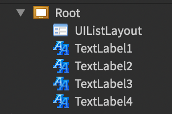
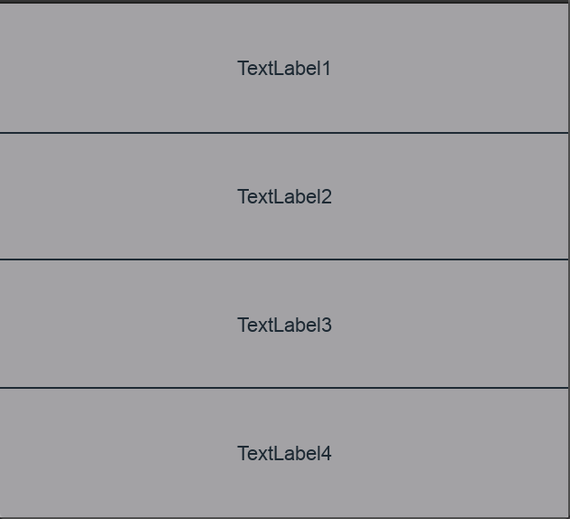

# Creating our own story
[<< Previous (Rendering UI)](3.rendering-ui.md) | [(Stateful components) Next >>](5.stateful-components.md)

Previously, we learned how to render storybook files using Roblox Studio. Now we may want to see what the workflow would look like when creating our own UI component from scratch.

----

Before we get started, we should take a moment to learn about Roblox's UI primitives that compose all of our UI.

> :information_source: Optional reading: [Roblox's Intro to GUIs](https://developer.roblox.com/en-us/articles/Intro-to-GUIs).

The Roblox Datamodel hierarchy is comprised of `Instances`. All `Instances` have a `ClassName` and can inherit from base classes. A majority of Roblox UI primitives inherit from the [`GuiObject`](https://developer.roblox.com/en-us/api-reference/class/GuiObject) abstract base class. To manipulate `GuiObjects`, we also have the [`UIComponent`](https://developer.roblox.com/en-us/api-reference/class/UIComponent) abstract base class which can dictate primitive positioning, sizing, and other effects.

For example, let's say we want to have a **list** of **text** labels on our screen that are all nested in a **div-like** container. Our Roblox datamodel will want to have the following tree:

```
> Frame
	> UIListLayout
	> TextLabel1
	> TextLabel2
	> TextLabel3
```

Roact works similarly to React -- it will take the Roact virtualized DOM structure and apply it to the Roblox Datamodel structure. Accessing the Roblox primitives is made possible by substituting the desired class name for the Roact component. We can produce the structure above with the following `*.story.lua` source:

```lua
local Packages = script:FindFirstAncestor("Packages")
local Roact = require(Packages.Roact)

return function()
	return Roact.createElement("Frame", {
		Size = UDim2.fromScale(1, 1),
	}, {
		UIListLayout = Roact.createElement("UIListLayout"),
		TextLabel1 = Roact.createElement("TextLabel", {
			Text = "TextLabel1",
			Size = UDim2.fromScale(1, 0.25),
		}),
		TextLabel2 = Roact.createElement("TextLabel", {
			Text = "TextLabel2",
			Size = UDim2.fromScale(1, 0.25),
		}),
		TextLabel3 = Roact.createElement("TextLabel", {
			Text = "TextLabel3",
			Size = UDim2.fromScale(1, 0.25),
		}),
		TextLabel4 = Roact.createElement("TextLabel", {
			Text = "TextLabel4",
			Size = UDim2.fromScale(1, 0.25),
		}),
	})
end
```

...which should produce something like this in our Roblox Studio Explorer window:



...which should then in turn produce something like this in our storybook viewport:



> :information_source: To read more about Roact, check out their [documentation here](https://roblox.github.io/roact/).

----

Let's apply what we've learned to create our own story. Feel free to create a new file under the `UI` folder and name it something like `test.story.lua` so that our storybook viewer will pick it up. Once we have our empty file, let's first import our Roact library:

```lua
-- test.story.lua
local Packages = script:FindFirstAncestor("Packages")
local Roact = require(Packages.Roact)
```

All of our stories are expected to return a **Roact Component**. Like React, we can return a function in place of a Roact Component. Let's keep it simple and return a function now:

```lua
--...

return function()

end
```

If we were to click on our story now, we would be a blank screen. This is because a functional component that returns nil will simply not render that node. Let's add a `TextButton` component that we can mess around with:

```lua
--...
return function()
	return Roact.createElement("TextButton")
end
```

If we were to stop here, we _still_ would not see anything. This is because we have created the TextButton, but it's AbsoluteSize is `0,0`. We can set the Size property of the TextButton to fix that:

```lua
--...
return function()
	return Roact.createElement("TextButton", {
		Size = UDim2.fromOffset(150, 32),
	})
end
```

> :information_source: Clicking on the `Explore` button at the bottom of the Storybook window will let you see all of the properties available to your primitives using Roblox Studio's Property window. This can be a helpful tool in diagnosing these types of issues in the future as well as a great way to familiarize yourself with the types of properties that are available to you!

Now we should have a button that is exactly 150x32 pixels, but it's looking a little drab. Let's edit the Text and add a splash of color!

```lua
--...
return function()
	return Roact.createElement("TextButton", {
		Size = UDim2.fromOffset(150, 32),
		BackgroundColor3 = Color3.fromRGB(0, 200, 80),
		Text = "Play!",
	})
end
```
Our button's looking pretty good now, but nothing happens when we click on it. We can address that by registering an event handler on our component.
All of our primitives have events that can accept functions as callbacks. With Roact, we can assign these events declaratively by using the `Roact.Event` notation:

```lua
--...
return function()
	return Roact.createElement("TextButton", {
		Size = UDim2.fromOffset(150, 32),
		BackgroundColor3 = Color3.fromRGB(0, 200, 80),
		Text = "Play!",
		[Roact.Event.Activated] = function()
			print("Clicked the button!")
		end,
	})
end
```
Open the Output console via the VIEW tab at the top of the Studio screen to see the output of the print statement.

And thats a wrap! Feel free to play around with these values or make more stories until you're comfortable in moving onto [stateful components](5.stateful-components.md)!

> :information_source: The [Roblox Class Index](https://developer.roblox.com/en-us/api-reference/index) is a great resource when trying to learn about all the different classes, properties, and events are available to you.

> :information_source: Some properties take particular DataTypes that aren't Luau primitives. You can familiarize yourself with non-primitive DataTypes using the [Roblox DataType Index](https://developer.roblox.com/en-us/api-reference/data-types).
